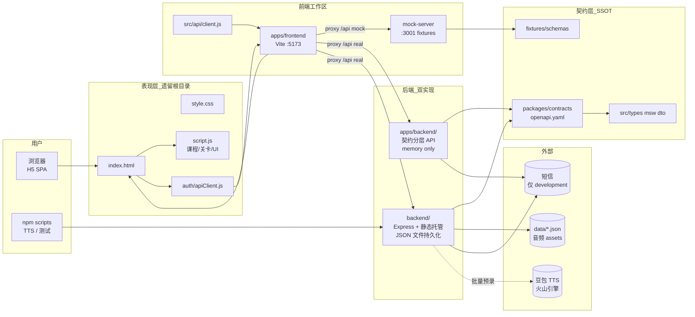
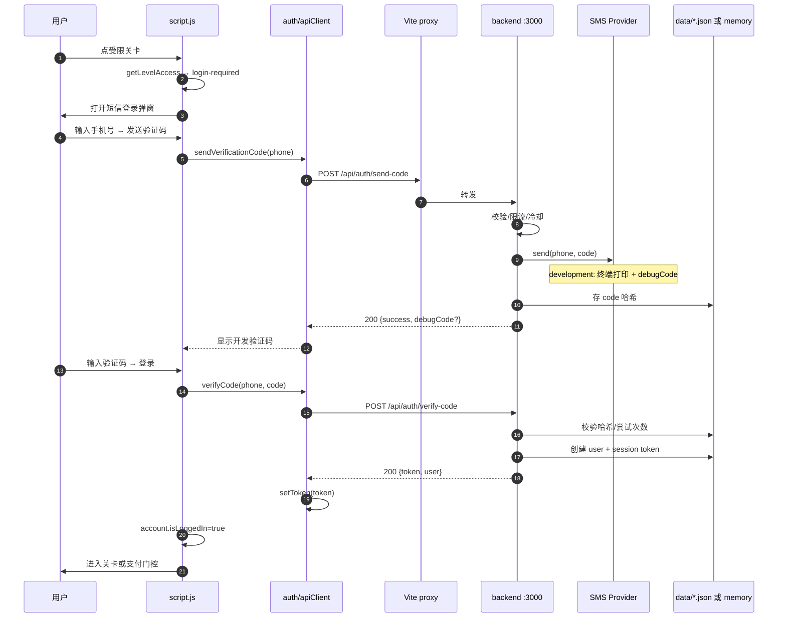
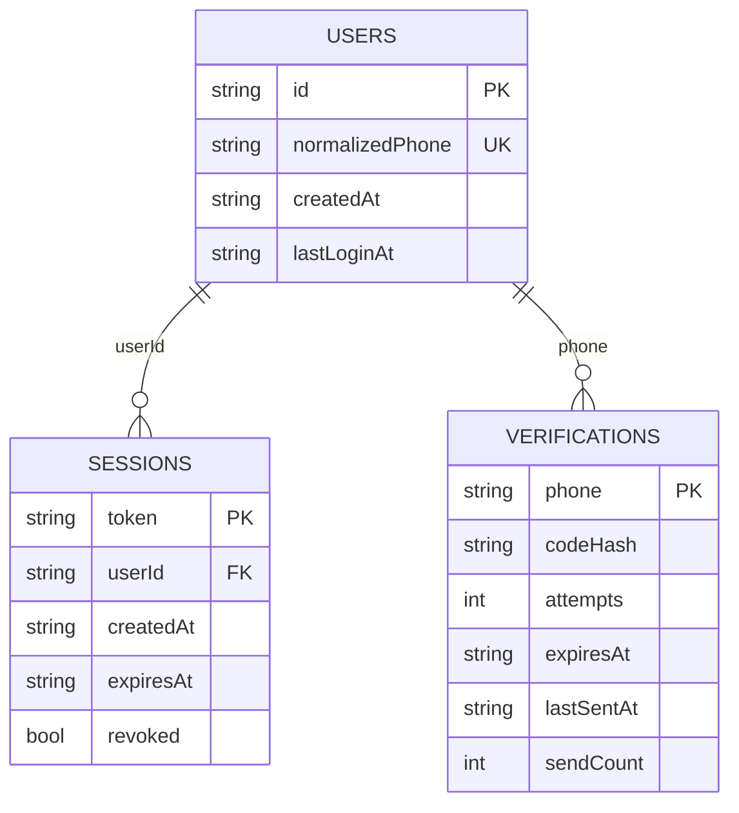
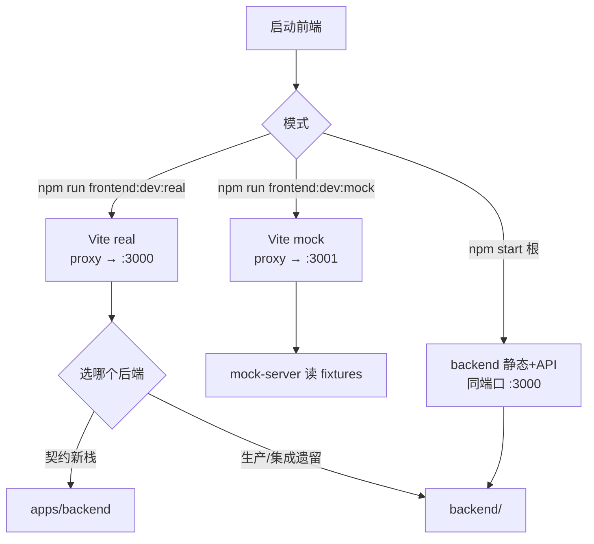
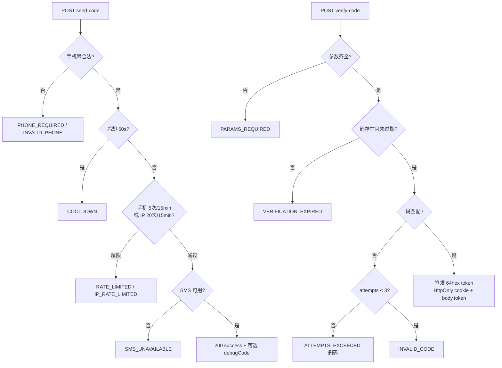
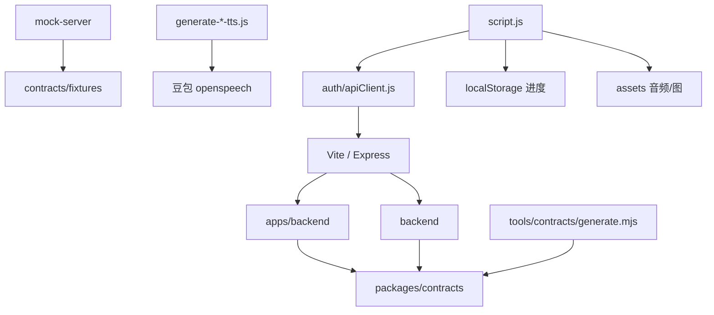

# 宝宝闯关 (baby-island-quest) — Codegraphy

> 模块依赖 + 数据流图。新 session 第一份读这个 + `~/.hermes/handoffs/baby-island-quest-*.md`。
>
> 产品：3–6 岁英语启蒙闯关 H5（宝宝英语岛）。前后端分离 + **契约驱动**（OpenAPI 0.1.0 冻结 5 条 auth/health 路由）。

## 1. 全局架构



## 2. 一次完整登录的时序



## 3. 持久化 Schema



- **legacy `backend/`**：`data/users.json` / `sessions.json` / `verifications.json`（启动 load，写入后异步 save）
- **`apps/backend/`**：`MemoryAuthRepository` 纯内存，无磁盘（未来 `DATABASE_URL` 边界未接通）
- **客户端进度**：`localStorage` key `baby-island-preview-progress-v1`（无后端）
- **登录标记**：`sessionStorage` `baby-island-preview-login` + token `baby-island-auth-token`

## 4. 运行模式对比



| 模式 | 前端 | API | 用途 |
|------|------|-----|------|
| mock 开发 | Vite :5173 | mock :3001 | 无后端 UI/契约联调 |
| real 开发 | Vite :5173 | :3000 | 真 auth 联调 |
| 一体启动 | 静态根目录 | `backend/` :3000 | 本地验收登录 + 静态资源 |
| 契约后端 | 任意 | `apps/backend` | 分层/contract 测试 |

## 5. 鉴权/限流/异常路径



安全要点：验证码 SHA-256 存盘、一次性消费、日志手机号脱敏、统一错误文案「验证码错误或已过期」。

## 6. 调用路径速查

| 场景 | 调用栈 |
|------|--------|
| 页面登录弹窗 | `script.js` 访问门控 → `window.babyIslandApi` (`auth/apiClient.js`) → `/api/auth/*` |
| Vite mock API | `apps/frontend` Vite proxy → `src/mock-server/server.cjs` → fixtures |
| 契约后端 HTTP | `apps/backend/src/server.js` → `app.js` → `transport/auth-router` → `service/auth-service` → `repository/memory-*` |
| 遗留后端 HTTP | `backend/src/index.js` → `auth.js` → `db.js` + `sms-provider.js` |
| 契约生成 | `npm run generate:contracts` → `tools/contracts/generate.mjs` → `packages/contracts/src/*` |
| 单词 TTS 预录 | `backend` `npm run generate-word-audio` → 豆包 → `assets/audio/words/` |
| 关卡判定 | `script.js` `getLevelAccess` / `applyQuizAnswer` / `normalizeProgress` |

## 7. 文件→模块反查表

```
宝宝闯关/
├── index.html / style.css / script.js   # 主 SPA（无框架）：地图/关卡/测验/排行/我的
├── auth/apiClient.js                    # 线上实际引用的 API 客户端
├── apps/frontend/                       # Vite 工作区：dev 代理 + mock server + 双模式
│   ├── vite.config.js                   # root=仓库根；proxy /api
│   ├── scripts/switch-mode.cjs          # 写 .env.local → mock|real
│   └── src/api/client.js                # 新版 client（与 auth/ 并行存在）
├── apps/backend/                        # 契约分层 Express（memory，无静态站）
├── backend/                             # 主集成后端：静态托管 + auth + TTS 工具链
├── packages/contracts/                  # API 唯一真相源 openapi/schemas/fixtures + 生成物
├── data/                                # 遗留后端 JSON 持久化
├── assets/                              # 岛屿图、BGM、单词/音色音频
├── doc/API_SPEC.md                      # 豆包 TTS 规格（非业务 API）
├── tools/contracts/                     # generate + validate
└── quiz.test.js 等                      # 根级 node:test 前端/生成器测试
```

## 8. 依赖图（谁依赖谁）



## 9. 踩坑位置搜索指引

| 错误症状 | 看哪里 |
|----------|--------|
| 登录一直「服务未启动」 | 是否起了 :3000；Vite 是否 real 且 proxy 对；CORS/`file://` |
| 验证码对不上 | `SMS_PROVIDER=development`；看后端终端 `[DEV SMS]`；`debugCode` 路径 |
| mock 与真后端字段不一致 | `packages/contracts/fixtures` vs openapi；勿手改生成物 |
| 改了 openapi 前后端类型没变 | `npm run generate:contracts` + validate |
| 两套 backend 行为漂移 | `backend/` 有磁盘；`apps/backend/` 仅 memory；确认当前 `npm start` 指向 |
| 第 11 关起被挡 | `getLevelAccess`：`levelId > FREE_LEVEL_COUNT && !vipActive` → 会员支付面板；VIP 后仍需对应课程资源已上线 |
| 进度丢了 | `localStorage` key `baby-island-preview-progress-v1` |
| TTS 鉴权失败 | `doc/API_SPEC.md`：`Authorization: Bearer;{token}` **分号**非空格 |
| 真实短信 | **阿里云已接入代码**；填 env 即可 |
| 静态资源 404 | 一体模式用 `backend` 静态根；Vite root 是仓库根 |

## 10. 冻结 API 一览（v0.1.0）

| Method | Path | Auth |
|--------|------|------|
| GET | `/api/health` | 无 |
| POST | `/api/auth/send-code` | 无 |
| POST | `/api/auth/verify-code` | 无 |
| GET | `/api/auth/session` | bearer / cookie |
| POST | `/api/auth/logout` | bearer / cookie |

**非后端**：课程 200 关、进度、排行榜基础数据 + 当前宝宝本地排名、我的页资料 → 全在 `script.js` / localStorage。
