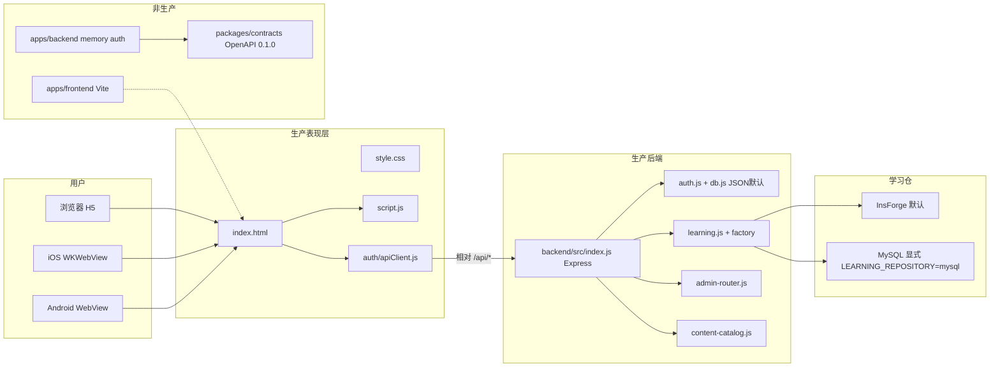
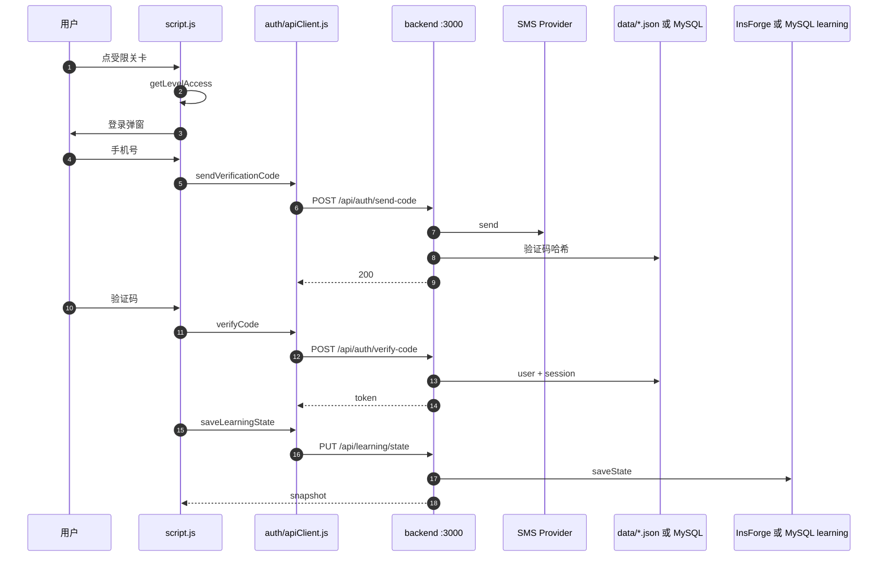
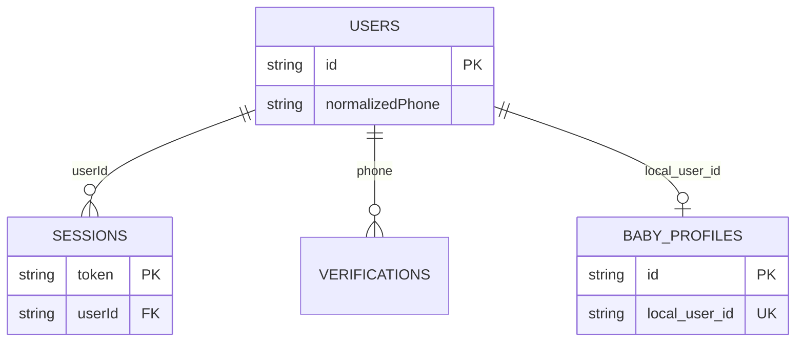
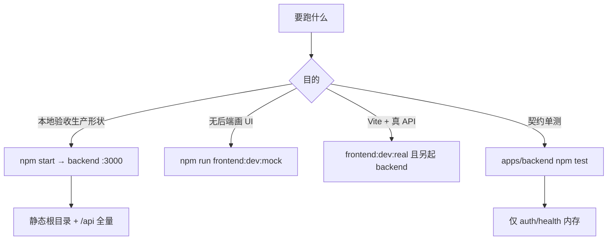

# 嗨洛塔少儿启蒙 APP — Codegraphy

> 模块依赖 + 数据流 + Graphify 读图。新 session：本文件 + `docs/TECH.md` + `docs/graphify-team/00-cursor-architecture.md`。  
> 项目根：`/Users/yr/嗨洛塔少儿启蒙APP`  
> 图快照：2026-08-13 · `/Users/yr/嗨洛塔少儿启蒙APP/graphify-out/README.md`  
> 产品：3–6 岁启蒙闯关 H5（英语地图 / 数学小桌）。生产形态 = 根目录 SPA + `backend/` Express 同端口；iOS/Android WebView 壳 pack 同一份 www。

旧标题 `baby-island-quest` / 「宝宝闯关」仍是 npm 包名与部分文档别名。绝对路径以 **嗨洛塔少儿启蒙APP** 为准。

---

## 0. 与 graphify-out 对齐的当前结构

Graphify **不是**全仓库图。语料 = 代码/文档 286 文件；排除 `assets/**` 媒体、node_modules、output、`.git`。

| 项 | 2026-08-13 |
|----|------------|
| files | 286 |
| nodes | 3462 |
| edges | 5743 |
| communities | 240（报告展示 226） |
| 抽取 | 91% EXTRACTED · 9% INFERRED |

产出绝对路径：

- `/Users/yr/嗨洛塔少儿启蒙APP/graphify-out/GRAPH_REPORT.md`
- `/Users/yr/嗨洛塔少儿启蒙APP/graphify-out/graph.html`
- `/Users/yr/嗨洛塔少儿启蒙APP/graphify-out/graph.json`
- `/Users/yr/嗨洛塔少儿启蒙APP/graphify-out/wiki/index.md`

图在说什么（读 hub 时先过滤 vendor/产物）：

1. **生产巨石在根 `script.js`**，不是 `apps/frontend`。  
2. **学习域中心在 `backend/src/learning.js`**，前端合并点 `mergeLearningStateFromCloud`。  
3. **契约/测试社区很大**（`quiz.test.js`、`contract.test.js`、`e2e-auth-flow.mjs`）——仓内测试与生成器权重高于「干净业务分层」。  
4. **`lottie.min.js` / `dist/script.js` 占最大社区** = 第三方与构建拷贝，**不是**产品架构中心。导航时跳过。

---

## 1. 全局架构（当前生产叙事）



一体启动：`npm start` → `backend` 托管仓库根静态文件，同时提供 `/api/*`。这是本地验收与生产 ECS 的同一形状。

非生产 Vite 可 proxy mock `:3001` 或 real `:3000`。`apps/backend` **没有** learning。real 联调应对准 `backend/`，不要假设契约后端能同步进度。

---

## 2. 社区 hub（GRAPH_REPORT 前列）

来源：`/Users/yr/嗨洛塔少儿启蒙APP/graphify-out/GRAPH_REPORT.md` 「Community Hubs (Navigation)」与 wiki 体积序。下列按**读架构时的优先级**分组，不是盲目按社区体积。

### 2.1 先读（业务真源）

| Hub | 为何是中心 | wiki |
|-----|------------|------|
| `script.js` | 生产 SPA 巨石；wiki：82 nodes，333 connections | `/Users/yr/嗨洛塔少儿启蒙APP/graphify-out/wiki/script.js.md` |
| `learning.js` | 生产 Learning HTTP；89 nodes 级社区 | `/Users/yr/嗨洛塔少儿启蒙APP/graphify-out/wiki/learning.js.md` |
| `auth-service.js` / `auth.js` | 契约层 vs 生产 auth | wiki `auth-service.js.md` · `auth.js.md` |
| `apiClient.js` | 前端唯一 `/api/*` 出口 | `apiClient.js.md` |
| `db.js` | JSON/MySQL auth 仓 | `db.js.md` |
| `content-catalog.js` | 运维内容目录 | `content-catalog.js.md` |
| `mergeLearningStateFromCloud` | 本地进度与云快照合并 | 函数社区 |
| `renderMap` / `normalizeMapWorldId` / `mathAssembleLevel` | 地图与数学关组装 | 多个同名社区，读最大那份 |
| `openLoginDialogForce` | 登录门控 | 函数社区 |
| `server.cjs` | frontend mock-server | 非生产 |

### 2.2 体积大但不要当架构中心

| Hub | 处理 |
|-----|------|
| `lottie.min.js` | vendor，130 nodes，跳过 |
| `dist/script.js` | 构建/拷贝产物社区，生产入口仍是根 `script.js` |
| `write-desert-workbench-prompts.cjs` 等生成器 | 内容产线，不是运行时 |
| `quiz.test.js` / `audit-readiness.mjs` / 一堆 `qa-*.mjs` | 测试与门禁，边多因为断言引用面广 |
| 中文文档社区（说明书、交接、审题） | 文档入图导致；架构以代码 hub 为准 |

GRAPH_REPORT 原始前列（未过滤）：`lottie.min.js` → `dist/script.js` → `learning.js` → `script.js` → `quiz.test.js` → 生成器 / `audit-readiness.mjs` → `renderMap` → `mathAssembleLevel` → `normalizeMapWorldId` → `content-catalog.js` → `user.json` → `auth-service.js` → `contract.test.js` → `mergeLearningStateFromCloud` → `apiClient.js` → `db.js` …

完整列表只在 `GRAPH_REPORT.md` 维护。本页不复制全部 240 社区。

---

## 3. 如何读 graph.html / wiki

### 3.1 `graph.html`

1. 用浏览器打开 `/Users/yr/嗨洛塔少儿启蒙APP/graphify-out/graph.html`（本地文件即可）。  
2. 先按社区着色看团块，不要从 `lottie.min.js` 团块开始拖。  
3. 搜索 `script.js`、`learning.js`、`apiClient.js`、`index.js`。  
4. 边 = 引用/共现/推断。INFERRED 约占 9%，置信度均值 0.53——跨语言、跨文档边可能是弱提示，验证时回源文件。  
5. `graph.json` 给 GraphRAG / 脚本，不给人读。

### 3.2 wiki

入口：`/Users/yr/嗨洛塔少儿启蒙APP/graphify-out/wiki/index.md`（社区按体积降序）。

读法：

1. index 点进社区文（如 `script.js.md`）。  
2. 「Key Concepts」是该团块内高连接符号。  
3. 「Relationships」是跨社区共享边——这是找「谁跟地图/登录/学习缠在一起」的最快路径。  
4. 同名社区会有 `foo.md` 与 `foo_2.md`（Graphify 拆薄社区）。体积大的优先；不要合并当成一个文件。  
5. 中文文件名社区来自 `docs/` 入图。要架构时回到代码 hub。

Wiki 是导航，不是规范。规范以 `backend/src/*.js` 与 `auth/apiClient.js` 为准。

---

## 4. 与 2026-07 旧数字的差异

旧 Graphify 团队文档（`docs/graphify-team/README.md`，更新栏 2026-07-21）写过：

| 项 | 约 2026-07 | 2026-08-13 |
|----|------------|------------|
| 项目根写法 | `/Users/yr/宝宝闯关` | `/Users/yr/嗨洛塔少儿启蒙APP` |
| 入图 files | 146（全库当时约 1146 含媒体） | **286** 代码/文档 |
| nodes | **~1243** | **3462** |
| edges | ~1961 | **5743** |
| communities | 81 | **240** |

**不是**业务突然变成 2.8 倍复杂。主因：

1. **语料变大：** 7 月后仓内增加 iOS/Android 壳、大量 QA/`tools/qa-*.mjs`、数学 AI、运维台、交接 Markdown、生成器。Graphify 把文档和测试算节点。  
2. **排除规则仍排除媒体，但代码/文档文件从 146 → 286。**  
3. **抽取更碎：** 同一 `script.js` 拆出 `renderMap`、`mathAssembleLevel`、`normalizeMapWorldId` 等函数社区，节点数涨、社区数涨。  
4. **vendor/产物入图：** `lottie.min.js`、`dist/script.js` 成为最大团块，7 月叙事几乎没把它们当 hub。

因此：**禁止用 1243/81 当当前规模。** 对外与新 session 只用 2026-08-13 的 286 / 3462 / 5743 / 240。旧数字只用于解释「为什么 7 月整理文档里的图指数对不上」。

7 月 codegraphy 还写「课程 200 关、进度、排行、我的页全在 `script.js` / localStorage、非后端」。**已过时。** 生产已有：

- `GET|PUT /api/learning/state` 等（`learning.js`）  
- `/api/me`、`/api/rankings`（`me-router.js`）  
- `/api/admin` + 内容目录  

本地 `localStorage`（如 `baby-island-preview-progress-v1`）仍在，作为离线/合并源，与云快照双写。合并逻辑在 `script.js` 的 `mergeLearningStateFromCloud` 社区。

---

## 5. 一次登录 + 学习同步（当前契约）



同步写路径只有 **`PUT /api/learning/state`**。客户端：`auth/apiClient.js` 的 PUT。服务端：`learning.js` `router.put('/state')`。无第二条全量 snapshot POST。

Learning 默认 InsForge；只有 `LEARNING_REPOSITORY=mysql` 才走 `MysqlLearningRepository`。

---

## 6. 持久化分域



| 域 | 默认 | 切换 | 代码 |
|----|------|------|------|
| Auth | JSON `data/users.json` 等 | `AUTH_REPOSITORY=mysql` | `/Users/yr/嗨洛塔少儿启蒙APP/backend/src/db.js` |
| Learning | InsForge Postgres | `LEARNING_REPOSITORY=mysql` | factory + 两个 `*-learning-repository.js` |
| 权益/排行账本 | JSON `data/entitlements.json` 等 | 无 factory | `entitlements.js` |
| 内容目录 | `data/content-catalog.json` | OSS URL 元数据 | `content-catalog.js` |
| 限流 | 内存 | `REDIS_URL` | `security.js` |
| 客户端进度 | localStorage | 登录后 PUT state | `script.js` |
| Token | sessionStorage `baby-island-auth-token` + cookie | 原生 `BABY_ISLAND_API_BASE` | `apiClient.js` |

表字段以 `/Users/yr/嗨洛塔少儿启蒙APP/docs/graphify-team/07-data-model.md` 与 `migrations/` 为准。

---

## 7. 运行模式



| 模式 | 前端 | API | 用途 |
|------|------|-----|------|
| 一体 | Express 静态根 | `backend/` :3000 | **生产同构** |
| Vite mock | :5173 | mock :3001 | 契约 fixtures，无学习同步 |
| Vite real | :5173 | :3000 | 须起 `backend/`，不是 `apps/backend` 就能同步 learning |
| 契约后端 | 任意 | `apps/backend` | 分层/contract 测试 |
| 原生 | bundle `www/` | 壳注入 API base | TestFlight / APK |

---

## 8. 调用路径速查

| 场景 | 调用栈 |
|------|--------|
| 登录弹窗 | `script.js` 门控 → `window.babyIslandApi` → `/api/auth/*` → `backend/src/auth.js` |
| 学习同步 | `apiClient.saveLearningState` → **`PUT /api/learning/state`** → `learning.js` → InsForge 或 MySQL |
| 数学陪练 | `POST /api/learning/math-coach` → 默认 `localMathCoachPlan`；`MATH_COACH_AI_ENABLED=1` 才尝试远程 |
| 我的权益 | `/api/me/entitlements` → `me-router.js` + `entitlements.js` |
| 运维台 | `/admin` + `/api/admin/*` → `admin-router.js`，`ADMIN_TOKEN` |
| 内容绑定 | `/api/admin/content/*` → `content-catalog.js` |
| Vite mock | `apps/frontend` proxy → `src/mock-server/server.cjs` → contracts fixtures |
| 契约 HTTP | `apps/backend/src/server.js` → auth-router → memory repo |
| www 打包 | `tools/pack-app-www.sh` → iOS Archive `www/` 或 `android/.../assets/www` |
| 契约生成 | `npm run generate:contracts` → `tools/contracts/generate.mjs` |

---

## 9. 文件 → 模块反查

```
/Users/yr/嗨洛塔少儿启蒙APP/
├── index.html / style.css / script.js / sw.js   # 生产 SPA
├── auth/apiClient.js                            # 线上 API 客户端
├── admin/                                       # 运维台页面
├── backend/src/index.js                         # 生产 Express
├── apps/frontend/                               # 非生产 Vite
├── apps/backend/                                # 非生产契约 API
├── packages/contracts/                          # OpenAPI 0.1.0（落后于生产 learning）
├── ios/BabyEnglishIsland/                       # WKWebView 壳
├── android/app/                                 # WebView 壳
├── tools/pack-app-www.sh                        # www 打包
├── data/                                        # JSON auth / 权益 / 目录
├── migrations/                                  # InsForge Postgres DDL
├── docs/TECH.md                                 # 技术总入口
├── docs/graphify-team/                          # 00–12
└── graphify-out/                                # 2026-08-13 图
```

---

## 10. 踩坑

| 症状 | 看哪里 |
|------|--------|
| 「服务未启动」 | 是否 `npm start` 起了 :3000；原生是否注入 `BABY_ISLAND_API_BASE`；CORS / `file://` |
| 验证码对不上 | `SMS_PROVIDER=development`；终端 `[DEV SMS]`；勿用生产 SMS 配本地 |
| 进度不同步 | 是否打了 **PUT** `/api/learning/state`；Learning kind 是否 `none`（缺 InsForge 又没 mysql） |
| 学习同步 404 / 错方法 | 必须 `PUT /api/learning/state`；不要自造 learning 全量 POST |
| 切了 MySQL 但 learning 仍 InsForge | 必须显式 `LEARNING_REPOSITORY=mysql`，有 `MYSQL_*` 不够 |
| Auth 意外打到 RDS | 只有 `AUTH_REPOSITORY=mysql`；`npm test` 强制 json |
| mock 与真后端字段不一致 | fixtures vs 生产 `learning.js`；OpenAPI 未覆盖 learning |
| 两套 backend 行为漂移 | `npm start` 只跑 `backend/` |
| 图上最大团是 lottie | 正常。业务从 `script.js` / `learning.js` 进 |
| 文档路径 宝宝闯关 404 | 根是 `/Users/yr/嗨洛塔少儿启蒙APP` |
| 原生缺视频 | 重新 `pack-app-www.sh`；L11+ 本就不进包 |
| TTS 失败 | 预录工具凭据；运行时播的是 `assets/` 静态音，不是请求时豆包 |

---

## 11. 冻结 API 与生产扩展面

契约包 v0.1.0 **冻结**：

| Method | Path |
|--------|------|
| GET | `/api/health` |
| POST | `/api/auth/send-code` |
| POST | `/api/auth/verify-code` |
| GET | `/api/auth/session` |
| POST | `/api/auth/logout` |

生产 `backend/` **额外**（未进 OpenAPI 0.1.0）：learning（含 **PUT** `/api/learning/state`）、`/api/me`、`/api/rankings`、`/api/admin`、`GET /healthz`。前端照样只走 `/api/*`，不绑云厂商 URL。

详情：`/Users/yr/嗨洛塔少儿启蒙APP/docs/graphify-team/00-cursor-architecture.md`、`/Users/yr/嗨洛塔少儿启蒙APP/docs/backend-architecture.md`。
