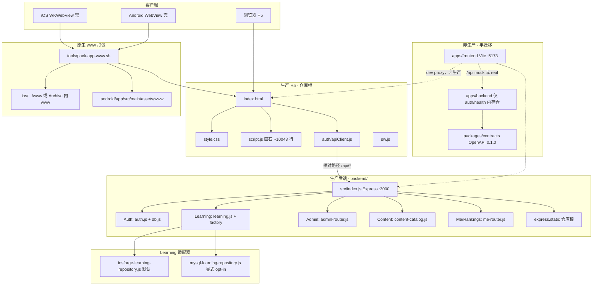
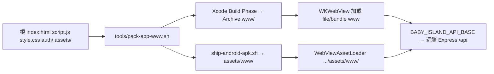

# 00 · 系统架构总览（Cursor Auto）

> 产品名：嗨洛塔少儿启蒙 APP（仓库 npm name 仍为 `baby-island-quest`）  
> 项目根：`/Users/yr/嗨洛塔少儿启蒙APP`  
> 文档日期：2026-08-13  
> 只写文档，不改业务代码。  
> Graphify 快照：`/Users/yr/嗨洛塔少儿启蒙APP/graphify-out/README.md`

---

## 0. 30 秒结论

| 点 | 事实 |
|----|------|
| **生产 H5** | 仓库根 `index.html` + `script.js` + `style.css` |
| **生产 API** | 根目录 `npm start` → `backend/` Express，静态站与 `/api/*` **同端口**（默认 `:3000`） |
| **非生产入口** | `apps/frontend`（Vite）、`apps/backend`（契约分层、仅 auth/health、内存仓）、`packages/contracts`（OpenAPI 0.1.0） |
| **Learning** | 默认 InsForge；`LEARNING_REPOSITORY=mysql` **显式**才切 RDS MySQL |
| **Auth 持久化** | 默认 JSON 文件 `data/*.json`；`AUTH_REPOSITORY=mysql` 显式切 MySQL |
| **学习同步** | `PUT /api/learning/state`（完整快照）。Learning 无其它全量写入 POST 别名 |
| **原生壳** | iOS `WKWebView` / Android `WebView` 加载 pack 后的 `www/` |
| **知识图** | 2026-08-13：286 files · 3462 nodes · 5743 edges · 240 communities |

---

## 1. 系统架构总览

生产路径是「根目录 H5 + `backend/` Express」。`apps/*` 与契约包是半迁移工作区，**不是** App Store / TestFlight 入口。

同端口语义：浏览器访问 `http://localhost:3000/` 拿到 H5；同一 origin 下 `POST /api/auth/verify-code`、`PUT /api/learning/state` 不跨域。原生壳用 `window.BABY_ISLAND_API_BASE` 把 `/api/*` 指到远端 Express。

---

## 2. 生产路径 vs 非生产路径

### 2.1 生产（真实用户 / TestFlight / 本地一体验收）

| 层 | 路径 | 证据 |
|----|------|------|
| H5 入口 | `/Users/yr/嗨洛塔少儿启蒙APP/index.html` | 引用 `style.css`、`auth/apiClient.js`、`script.js` |
| 逻辑巨石 | `/Users/yr/嗨洛塔少儿启蒙APP/script.js` | 地图 / 测验 / 数学桌 / HUD / 登录门控 |
| 样式 | `/Users/yr/嗨洛塔少儿启蒙APP/style.css` | ~13370 行 |
| API 客户端 | `/Users/yr/嗨洛塔少儿启蒙APP/auth/apiClient.js` | `window.babyIslandApi`；相对 `/api/*` |
| 进程入口 | 根 `package.json` `"start": "cd backend && npm start"` | 再进 `backend/package.json` `"start": "node src/index.js"` |
| Express | `/Users/yr/嗨洛塔少儿启蒙APP/backend/src/index.js` | `express.static(仓库根)` + `app.use('/api/...')` |
| 默认端口 | `PORT` 或缺省 `3000` | 同文件 |

**不要**把 `apps/frontend` 的 Vite dev server 当成生产入口。`frontend:build` 存在，但当前 TestFlight / APK pack 拷的是根目录三件套，不是 Vite dist。

### 2.2 非生产（契约 / 分层实验）

| 工作区 | 绝对路径 | 现状 |
|--------|----------|------|
| Vite 前端壳 | `/Users/yr/嗨洛塔少儿启蒙APP/apps/frontend` | `vite.config.js` 的 `root` 仍指向仓库根；mock `:3001` / real `:3000` |
| 契约后端 | `/Users/yr/嗨洛塔少儿启蒙APP/apps/backend` | transport → service → `MemoryAuthRepository`；**无** learning / admin / content |
| 契约 SSOT | `/Users/yr/嗨洛塔少儿启蒙APP/packages/contracts` | `openapi/openapi.yaml` v0.1.0 **只冻** health + 4 条 auth |

OpenAPI 描述写明：课程、进度、排行、资料「remain client-side」。这已过时——生产 `backend/` 已有 learning / me / admin。契约包**落后于**生产 Express。这是半迁移的核心裂缝，不是笔误。

---

## 3. 模块边界与源路径

前端只打项目自己的 `/api/*`。InsForge、RDS、OSS、Redis、短信厂商全部停在 Express 实现层。见 `/Users/yr/嗨洛塔少儿启蒙APP/docs/backend-architecture.md`。

### 3.1 Auth

**职责：** 短信验证码登录、session、登出、虚拟登录（开发）、IP 限流。

| 角色 | 绝对路径 |
|------|----------|
| 生产路由 | `/Users/yr/嗨洛塔少儿启蒙APP/backend/src/auth.js` |
| JSON/MySQL 仓 | `/Users/yr/嗨洛塔少儿启蒙APP/backend/src/db.js` |
| 短信 | `/Users/yr/嗨洛塔少儿启蒙APP/backend/src/sms-provider.js` |
| 虚拟登录 | `/Users/yr/嗨洛塔少儿启蒙APP/backend/src/virtual-login.js` |
| 限流 | `/Users/yr/嗨洛塔少儿启蒙APP/backend/src/security.js` |
| 前端客户端 | `/Users/yr/嗨洛塔少儿启蒙APP/auth/apiClient.js` |
| 非生产分层 | `/Users/yr/嗨洛塔少儿启蒙APP/apps/backend/src/transport/auth-router.js` |
| | `/Users/yr/嗨洛塔少儿启蒙APP/apps/backend/src/service/auth-service.js` |
| | `/Users/yr/嗨洛塔少儿启蒙APP/apps/backend/src/repository/memory-auth-repository.js` |
| 契约 | `/Users/yr/嗨洛塔少儿启蒙APP/packages/contracts/openapi/openapi.yaml` |
| JSON 落盘 | `/Users/yr/嗨洛塔少儿启蒙APP/data/users.json` · `sessions.json` · `verifications.json` |

HTTP（生产与契约共有的冻结面）：

| Method | Path |
|--------|------|
| POST | `/api/auth/send-code` |
| POST | `/api/auth/verify-code` |
| GET | `/api/auth/session` |
| POST | `/api/auth/logout` |

鉴权默认 **JSON**（`resolveAuthRepository()`：`NODE_ENV=test` 或 `AUTH_FORCE_JSON=1` 强制 json；仅显式 `AUTH_REPOSITORY=mysql` 且存在 `MYSQL_HOST` 才切 MySQL）。`LEARNING_REPOSITORY=mysql` **不会**隐式改 Auth——以 `db.js` 为准，旧运维文若写「learning=mysql 连带 auth」视为过时。

### 3.2 Learning

**职责：** 孩子资料 / 偏好 / 各图进度 / 打卡日 / 错题本 / 答题流水 / 家长反馈 / 数学陪练计划。

| 角色 | 绝对路径 |
|------|----------|
| 路由 | `/Users/yr/嗨洛塔少儿启蒙APP/backend/src/learning.js` |
| 工厂 | `/Users/yr/嗨洛塔少儿启蒙APP/backend/src/learning-repository-factory.js` |
| InsForge 适配器 | `/Users/yr/嗨洛塔少儿启蒙APP/backend/src/insforge-learning-repository.js` |
| MySQL 适配器 | `/Users/yr/嗨洛塔少儿启蒙APP/backend/src/mysql-learning-repository.js` |
| 数学 AI 可选层 | `/Users/yr/嗨洛塔少儿启蒙APP/backend/src/math-coach-ai.js` |
| 挂载 | `/Users/yr/嗨洛塔少儿启蒙APP/backend/src/index.js` → `app.use('/api/learning', ...)` |
| 客户端 | `/Users/yr/嗨洛塔少儿启蒙APP/auth/apiClient.js`（`saveLearningState` = PUT state） |
| Postgres DDL | `/Users/yr/嗨洛塔少儿启蒙APP/migrations/` |

HTTP（**仅生产 `backend/`**；`apps/backend` 没有这些路由）：

| Method | Path | 语义 |
|--------|------|------|
| GET | `/api/learning/state` | 读快照 |
| **PUT** | **`/api/learning/state`** | **写完整学习快照（同步唯一入口）** |
| PATCH | `/api/learning/preferences` | 部分偏好 |
| POST | `/api/learning/quiz-attempts` | 追加答题事件 |
| POST | `/api/learning/support-feedback` | 反馈 |
| POST | `/api/learning/math-coach` | 数学陪练计划（默认本地规则） |

同步写路径只有 `PUT /api/learning/state`。`learning.js` 没有其它全量 snapshot POST。历史 HUD 草稿若写了别的 learning 写入路径，以本文件与 `router.put('/state')` 为准。客户端与测试：

- `/Users/yr/嗨洛塔少儿启蒙APP/auth/apiClient.js`
- `/Users/yr/嗨洛塔少儿启蒙APP/backend/src/learning.js`（`router.put('/state', ...)`）
- `/Users/yr/嗨洛塔少儿启蒙APP/backend/src/learning.test.js`

**默认后端：InsForge。** 工厂 `resolveLearningBackendKind()`：

1. `LEARNING_REPOSITORY` / `LEARNING_BACKEND` 显式 `mysql` / `rds` → MySQL  
2. 显式 `insforge` / `postgres` / `pg` → InsForge  
3. 显式 `none` / `off` / `disabled` → 关闭  
4. **未设置**：有 `INSFORGE_URL` + `INSFORGE_SERVICE_KEY` → 默认 InsForge；否则 `none`（拒绝静默假成功）

MySQL **必须** `LEARNING_REPOSITORY=mysql`（或 `LEARNING_BACKEND=mysql`）。未写该键时，即使本机 `.env` 里有 `MYSQL_*`，Learning 也不走 RDS。

工厂把 `serviceKey: INSFORGE_SERVICE_KEY` 传入构造函数，但 `InsForgeLearningRepository` 实际读 `options.apiKey` / `INSFORGE_API_KEY`。两套键名并存是债，不是「两个后端」。运行时 SDK 凭据以 `INSFORGE_URL` + `INSFORGE_API_KEY` 为准；factory 缺省判定看 `INSFORGE_SERVICE_KEY`。

### 3.3 Admin

**职责：** 运维台（用户封禁、VIP、短信事件、内容总览）。鉴权 `ADMIN_TOKEN`（Bearer / `X-Admin-Token`）。

| 角色 | 绝对路径 |
|------|----------|
| API | `/Users/yr/嗨洛塔少儿启蒙APP/backend/src/admin-router.js` |
| 页面 | `/Users/yr/嗨洛塔少儿启蒙APP/admin/index.html` |
| 页面脚本 | `/Users/yr/嗨洛塔少儿启蒙APP/admin/admin.js` |
| 挂载 | `index.js`：`/api/admin` + `GET /admin` |

内容写接口走 Admin，不走 H5 `script.js`。

### 3.4 Content

**职责：** 地图 / 关卡 / 视频绑定 / OSS 元数据；写 `data/content-catalog.json`，发布 `asset-packs.json`。

| 角色 | 绝对路径 |
|------|----------|
| 目录实现 | `/Users/yr/嗨洛塔少儿启蒙APP/backend/src/content-catalog.js` |
| 管理路由 | `admin-router.js` 的 `/content/*` |
| OSS 静态 302 | `/Users/yr/嗨洛塔少儿启蒙APP/backend/src/oss.js` |
| 包清单 | `/Users/yr/嗨洛塔少儿启蒙APP/asset-packs.json` |
| 权益账本 | `/Users/yr/嗨洛塔少儿启蒙APP/backend/src/entitlements.js` |
| 登录用户 API | `/Users/yr/嗨洛塔少儿启蒙APP/backend/src/me-router.js`（`/api/me`、`/api/rankings`） |

H5 闯关内容（词表、关卡组装、数学桌）仍大量内嵌 `script.js`。Content 模块管的是**运维目录与分发 URL**，不是课程题库 SSOT。

---

## 4. iOS / Android WebView 壳与 pack www

三端共用同一份根目录 H5。壳不重写业务，只注入 API base、IAP / asset-pack bridge。

| 件 | 绝对路径 |
|----|----------|
| Pack 脚本 | `/Users/yr/嗨洛塔少儿启蒙APP/tools/pack-app-www.sh` |
| iOS 壳 | `/Users/yr/嗨洛塔少儿启蒙APP/ios/BabyEnglishIsland/ViewController.swift` |
| iOS 入口 | `/Users/yr/嗨洛塔少儿启蒙APP/ios/BabyEnglishIsland/AppDelegate.swift` |
| iOS 工程调 pack | `/Users/yr/嗨洛塔少儿启蒙APP/ios/BabyEnglishIsland.xcodeproj/project.pbxproj`（Build Phase `Copy H5 app`） |
| Android 壳 | `/Users/yr/嗨洛塔少儿启蒙APP/android/app/src/main/java/com/modelisms/kids/MainActivity.kt` |
| Android 出包 | `/Users/yr/嗨洛塔少儿启蒙APP/tools/ship-android-apk.sh` |
| Android www 目标 | `/Users/yr/嗨洛塔少儿启蒙APP/android/app/src/main/assets/www` |

Pack 铁律（脚本头注释）：非视频运行时进包；课程 mp4 仅种子 L01–L10；数学 story 31 条 mp4 + 主题音进包；L11+ 走下载 / CDN；草稿目录不准进包。

壳注入：`window.BABY_ISLAND_API_BASE`。`auth/apiClient.js` 有 apiBase 时不走 local mock。

---

## 5. Graphify 2026-08-13 数字

来源：`/Users/yr/嗨洛塔少儿启蒙APP/graphify-out/README.md` 与 `GRAPH_REPORT.md`。

| 项 | 值 |
|----|-----|
| 日期 | 2026-08-13 |
| 聚焦语料 | **286** files（代码/文档；排除 `assets/**` 媒体、node_modules、output、`.git`） |
| 节点 | **3462** |
| 边 | **5743** |
| 社区 | **240**（报告展示 226，14 个过薄省略） |
| 抽取 | 91% EXTRACTED · 9% INFERRED · 0% AMBIGUOUS |

这不是全仓库文件图。媒体资产未入图。读图方式见 `/Users/yr/嗨洛塔少儿启蒙APP/docs/codegraphy.md`。

产出：

- `/Users/yr/嗨洛塔少儿启蒙APP/graphify-out/GRAPH_REPORT.md`
- `/Users/yr/嗨洛塔少儿启蒙APP/graphify-out/graph.html`
- `/Users/yr/嗨洛塔少儿启蒙APP/graphify-out/graph.json`
- `/Users/yr/嗨洛塔少儿启蒙APP/graphify-out/wiki/`

与 2026-07 旧快照差异（约 1243 nodes / 1961 edges / 81 社区 / 146 files）见 `docs/codegraphy.md` §旧数字。

---

## 6. 文档地图（00–12）

索引：`/Users/yr/嗨洛塔少儿启蒙APP/docs/graphify-team/README.md`  
技术总入口：`/Users/yr/嗨洛塔少儿启蒙APP/docs/TECH.md`

下列为目标路径。部分文件尚未生成，链接仍列出，避免编号漂移。

| # | 目标路径 | 职责 | 2026-08-13 状态 |
|---|----------|------|-----------------|
| 00 | `/Users/yr/嗨洛塔少儿启蒙APP/docs/graphify-team/00-cursor-architecture.md` | 架构总览（本文） | 本轮覆盖重写 |
| 01 | `/Users/yr/嗨洛塔少儿启蒙APP/docs/graphify-team/01-inventory.md` | 目录 / 入口 / 测试清单 | 目标，尚未生成 |
| 02 | `/Users/yr/嗨洛塔少儿启蒙APP/docs/graphify-team/02-product-loop.md` | 产品闭环 | 已有（2026-07；路径仍写旧根名） |
| 03 | `/Users/yr/嗨洛塔少儿启蒙APP/docs/graphify-team/03-backend-api.md` | 后端 API | 已有 |
| 04 | `/Users/yr/嗨洛塔少儿启蒙APP/docs/graphify-team/04-deploy-ops.md` | 部署 / 运维 / 迁移 | 已有。**04 永远是 deploy** |
| 05 | `/Users/yr/嗨洛塔少儿启蒙APP/docs/graphify-team/05-audit-gaps.md` | 审计快照（历史真相） | 已有 |
| 06 | `/Users/yr/嗨洛塔少儿启蒙APP/docs/graphify-team/06-frontend-hud.md` | 前端 HUD / 地图 / 答题 | 目标。仓内现存误编号副本 `04-frontend-hud.md`，读时按 HUD 文档处理，勿与 deploy 的 04 混淆 |
| 07 | `/Users/yr/嗨洛塔少儿启蒙APP/docs/graphify-team/07-data-model.md` | 表与 LearningState | 已有 |
| 08 | `/Users/yr/嗨洛塔少儿启蒙APP/docs/graphify-team/08-doc-catalog.md` | 文档目录与交叉链接 | 目标，尚未生成 |
| 09 | `/Users/yr/嗨洛塔少儿启蒙APP/docs/graphify-team/09-consistency-check.md` | 产品-数据-部署一致性 | 目标，尚未生成 |
| 10 | `/Users/yr/嗨洛塔少儿启蒙APP/docs/graphify-team/10-deploy-code-verify.md` | 部署文 ↔ 代码核验 | 目标，尚未生成 |
| 11 | `/Users/yr/嗨洛塔少儿启蒙APP/docs/graphify-team/11-frontend-api-verify.md` | 前端 API 终检 | 目标，尚未生成 |
| 12 | `/Users/yr/嗨洛塔少儿启蒙APP/docs/graphify-team/12-complete-signoff.md` | 完整度签字 | 目标，尚未生成 |

相邻技术文档（非 00–12 编号，但架构必读）：

- `/Users/yr/嗨洛塔少儿启蒙APP/docs/TECH.md`
- `/Users/yr/嗨洛塔少儿启蒙APP/docs/backend-architecture.md`
- `/Users/yr/嗨洛塔少儿启蒙APP/docs/codegraphy.md`
- `/Users/yr/嗨洛塔少儿启蒙APP/graphify-out/README.md`

---

## 7. 技术债要点

### 7.1 双后端半迁移

| | `backend/` | `apps/backend/` |
|--|-------------|-----------------|
| 谁在跑生产 | **是** | 否 |
| 静态 H5 | 同端口托管仓库根 | 无 |
| Auth | JSON 或 MySQL | 纯内存 |
| Learning / Admin / Content / Me | 有 | **无** |
| 契约测试 | 部分对齐 OpenAPI | 专测冻结 5 路由 |

两套 Express 会漂移。本地 `npm start` 只启动 `backend/`。不要按 `apps/backend` 配生产 CORS / SMS / 仓库。

### 7.2 JSON Auth

默认用户、session、验证码哈希写在 `data/*.json` + 进程内 Map。适合单机开发，不适合多实例。切 RDS 必须显式 `AUTH_REPOSITORY=mysql`。测试强制 json，避免本机 `.env` 把 `npm test` 拖进真实 MySQL。

### 7.3 Learning 双适配器

InsForge（默认）与 MySQL（opt-in）并行。表语义对齐 `baby_profiles` 等 6 张；Postgres 数组 / JSONB 在 MySQL 侧变 JSON。RLS 不搬到 MySQL——权限继续由 Express session + repository 执行。InsForge adapter 在数据校验完成前不要删。

未配置 InsForge 且未显式 mysql 时 kind=`none`，learning 写接口应失败而非假 200。

### 7.4 `script.js` 巨石

`/Users/yr/嗨洛塔少儿启蒙APP/script.js` **10043 行**：地图渲染、英语关、数学桌、登录门控、本地进度、云同步合并、音效、asset pack UI 全堆一文件。Graphify 社区 `script.js` 82 nodes、与 `quiz.test.js` / `renderMap` / `normalizeMapWorldId` 大量共享边。图上还有 `dist/script.js`、`lottie.min.js` 等 vendor/产物社区——**不要**把它们当成业务 SSOT。拆分前，生产入口仍是根目录这一份。

### 7.5 其它裂缝（架构相关，不在本轮修代码）

- OpenAPI 0.1.0 未收录 learning / me / admin。  
- `INSFORGE_SERVICE_KEY` vs `INSFORGE_API_KEY` 工厂与构造函数不一致。  
- 文档地图 04 编号曾被 HUD 占用；HUD 目标号是 06。  
- 旧文档项目根写成 `/Users/yr/宝宝闯关`；本仓根是 `/Users/yr/嗨洛塔少儿启蒙APP`。

---

## 8. 证据索引（绝对路径）

| 主张 | 证据 |
|------|------|
| 生产 H5 三件套 | `/Users/yr/嗨洛塔少儿启蒙APP/index.html` |
| `npm start` 进 backend | `/Users/yr/嗨洛塔少儿启蒙APP/package.json` |
| Express 静态+API 同端口 | `/Users/yr/嗨洛塔少儿启蒙APP/backend/src/index.js` |
| Learning 挂载与 health | 同上 |
| PUT state 为学习同步唯一全量写 | `/Users/yr/嗨洛塔少儿启蒙APP/backend/src/learning.js` |
| Learning 默认 InsForge / mysql 显式 | `/Users/yr/嗨洛塔少儿启蒙APP/backend/src/learning-repository-factory.js` |
| Auth 默认 JSON | `/Users/yr/嗨洛塔少儿启蒙APP/backend/src/db.js` |
| 前端只调 `/api/*` | `/Users/yr/嗨洛塔少儿启蒙APP/auth/apiClient.js` · `/Users/yr/嗨洛塔少儿启蒙APP/docs/backend-architecture.md` |
| 契约非生产 | `/Users/yr/嗨洛塔少儿启蒙APP/packages/contracts/openapi/openapi.yaml` · `/Users/yr/嗨洛塔少儿启蒙APP/apps/backend/README.md` |
| iOS pack | `/Users/yr/嗨洛塔少儿启蒙APP/tools/pack-app-www.sh` · `project.pbxproj` |
| Android pack | `/Users/yr/嗨洛塔少儿启蒙APP/tools/ship-android-apk.sh` |
| Graphify 数字 | `/Users/yr/嗨洛塔少儿启蒙APP/graphify-out/README.md` |

---

## 9. 给下一席的硬规则

1. 改登录 / 学习同步：先动 `backend/` + `auth/apiClient.js`，再考虑是否回写 OpenAPI。  
2. 学习全量保存只用 `PUT /api/learning/state`。不要发明额外的 learning 全量 POST。  
3. 未设 `LEARNING_REPOSITORY=mysql` 时，当 InsForge 路径处理；不要把本机 MySQL 环境当成生产默认。  
4. 前端禁止直连 InsForge / RDS / OSS / Redis。  
5. 原生包内容以 `pack-app-www.sh` 为准，不要手拷残缺 `www/`。  
6. 架构叙事用根路径 `/Users/yr/嗨洛塔少儿启蒙APP`，不要只写「宝宝闯关」当绝对路径。
