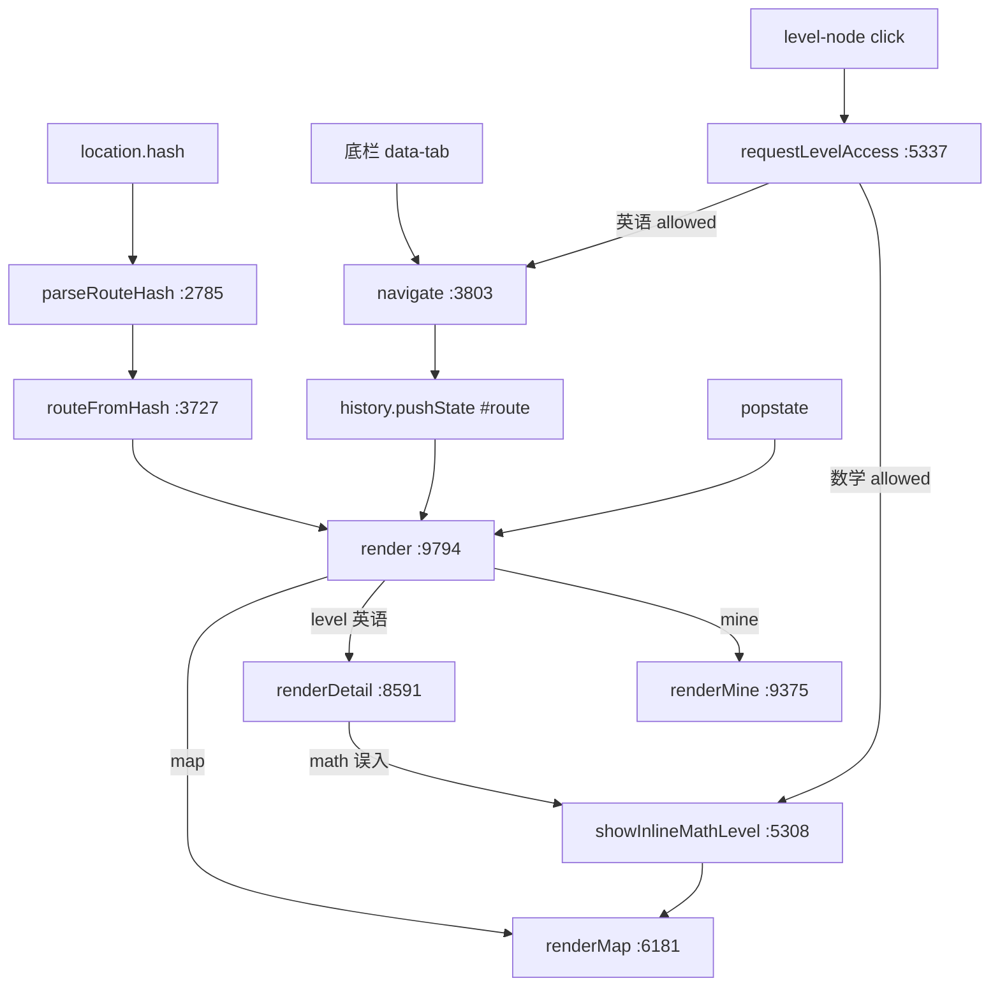
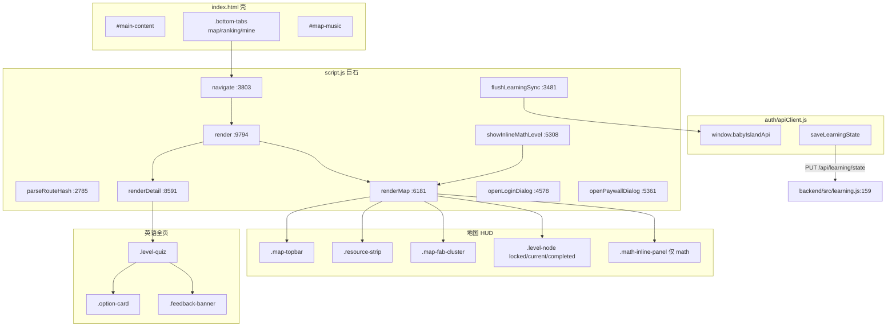

# 06 · 前端 HUD / 地图 / 答题

> 产品名：嗨洛塔少儿启蒙 APP（仓库 npm name 仍为 `baby-island-quest`）  
> 项目根：`/Users/yr/嗨洛塔少儿启蒙APP`  
> 文档日期：2026-08-13  
> 只写文档，不改业务代码。  
> 编号约定：04=deploy/ops · **06=frontend HUD**（曾误占 04；仓内 `_stale-04-frontend-hud.md.bak` 是错路由史料，勿当现行契约）  
> Graphify 快照：`/Users/yr/嗨洛塔少儿启蒙APP/graphify-out/README.md`

---

## 0. 30 秒结论

| 点 | 事实 | 证据 |
|----|------|------|
| **生产 H5** | 仓库根 `index.html` + `script.js` + `style.css` | `/Users/yr/嗨洛塔少儿启蒙APP/index.html:22,28-29` |
| **非生产** | `apps/frontend` 是 Vite 脚手架，**不是** App Store / TestFlight 入口 | `/Users/yr/嗨洛塔少儿启蒙APP/apps/frontend/README.md` |
| **路由** | hash → `parseRouteHash` → `routeFromHash` → `navigate` → `render` | `script.js:2785,3727,3803,9794` |
| **地图 HUD** | `map-topbar` / `resource-strip` / `.map-fab-cluster` / `#map-music` / `.level-node` | `script.js:6301-6359`；`style.css:389,538,1212` |
| **英语答题** | 全页 `.level-quiz` + `.option-card` + `.feedback-banner` | `script.js:8655,8970,8690` |
| **数学** | **不进**全页 quiz 壳；`showInlineMathLevel` 把 `.math-inline-panel` 留在 `#map` 视图 | `script.js:5308,6156,8589-8598` |
| **登录 / 付费** | `openLoginDialog` / `openPaywallDialog`；「我的」=`renderMine` | `script.js:4578,5361,9375` |
| **学习同步** | `window.babyIslandApi.saveLearningState` → **`PUT /api/learning/state`** | `auth/apiClient.js:415-416,469` |
| **HTTP 层无 upsert** | **不存在** `POST /api/learning/upsert`。旧文档写它 = **ERROR** | `backend/src/learning.js:151-167` |

---

## 1. 生产 UI 入口（不是 `apps/frontend`）

生产用户看到的 SPA **只有仓库根三件套**。Express 用 `express.static(仓库根)` 同端口托管它们；iOS / Android 壳 pack 的也是这三份（经 `tools/pack-app-www.sh`），不是 Vite `dist`。

| 文件 | 绝对路径 | 职责 | 体量（约） |
|------|----------|------|------------|
| 壳 HTML | `/Users/yr/嗨洛塔少儿启蒙APP/index.html` | splash、`#main-content`、底栏、`#map-music`、脚本顺序 | ~95 行 |
| 样式 | `/Users/yr/嗨洛塔少儿启蒙APP/style.css` | HUD / 地图 / quiz / 数学桌 / 登录 / paywall | ~13371 行 |
| 逻辑巨石 | `/Users/yr/嗨洛塔少儿启蒙APP/script.js` | 路由、地图、答题、数学、登录、同步 | **10043** 行 |
| API 客户端 | `/Users/yr/嗨洛塔少儿启蒙APP/auth/apiClient.js` | `window.babyIslandApi`；相对 `/api/*` | 485 行 |

`index.html` 加载顺序（`/Users/yr/嗨洛塔少儿启蒙APP/index.html:22-29`）：

1. `style.css`
2. splash CSS + 词音频 manifest + Lottie
3. **`auth/apiClient.js`（defer）** — 必须先于 `script.js`，否则 `window.babyIslandApi` 空
4. **`script.js`（defer）**

壳 DOM 极瘦：没有 `#map` 元素。地图是 **hash 路由** `#map`，视图由 `render()` 灌进 `<main id="main-content">`。底栏写死在 HTML：`data-tab="map|ranking|mine"`（`index.html:60-91`）。背景乐节点 `#map-music` 也写死在 HTML（`index.html:58`），不随 `innerHTML` 销毁。

**不要**把下列路径当生产入口：

| 路径 | 实际身份 |
|------|----------|
| `/Users/yr/嗨洛塔少儿启蒙APP/apps/frontend` | Vite 开发壳，`root` 指回仓库根（见 §8） |
| `/Users/yr/嗨洛塔少儿启蒙APP/apps/frontend/dist` | `frontend:build` 产物拷贝，可漂移 |
| `/Users/yr/嗨洛塔少儿启蒙APP/ios/BabyEnglishIsland/www/` | pack 副本；行数可落后根目录 |
| `/Users/yr/嗨洛塔少儿启蒙APP/android/app/src/main/assets/www/` | 同上 |

生产启动：根目录 `npm start` → `backend/` Express `:3000` 托管上述三件套 + `/api/*`。

---

## 2. Hash 路由：`parseRouteHash` / `routeFromHash` / `navigate` / `render`

### 2.1 解析（纯函数，IIFE 外）

`parseRouteHash` `/Users/yr/嗨洛塔少儿启蒙APP/script.js:2785-2794`：

| 输入 hash（可带/不带 `#`） | 返回 |
|---------------------------|------|
| `''` / `map` | `{ type: 'map' }` |
| `level-{n}` | `{ type: 'level', id: Number }` |
| `ranking` / `mine` / `support` / `accuracy` | `{ type: 同名 }` |
| `privacy` / `terms` / `about` | `{ type: 'info', page }` |
| 其它 | `{ type: 'not-found', hash }` |

`routeFromHash` `/Users/yr/嗨洛塔少儿启蒙APP/script.js:3727-3729`：对 `location.hash` 调 `parseRouteHash`。无独立 `hashchange` 监听。

### 2.2 跳转

`navigate(route, historyState)` `/Users/yr/嗨洛塔少儿启蒙APP/script.js:3803-3808`：

1. 若已是 `#${route}` 则 return
2. `history.pushState(historyState, '', `#${route}`)`
3. `render()`
4. `window.scrollTo(0, 0)` + `rememberLastStay()`

底栏点击：`tabButtons.forEach` → `navigate(button.dataset.tab)`（`script.js:9903-9904`）。浏览器后退：`window.addEventListener('popstate', render)`（`script.js:9921`）。冷启动无 hash：`history.replaceState(null, '', '#map')` 再 `render()`（`script.js:9929-9931`）。

### 2.3 渲染分发

`render()` `/Users/yr/嗨洛塔少儿启蒙APP/script.js:9794-9887`：

```
routeFromHash()
  ├─ type === 'level' 且当前世界 math
  │     replaceState('#map') → renderMap()（数学永不进全页 quiz）
  │     access === 'paid' → rAF openPaywallDialog
  ├─ type === 'level' 且英语，access !== 'allowed'
  │     replaceState('#map') → renderMap() + 可能 paywall
  ├─ type === 'level' 且英语 allowed
  │     body.level-quiz-active；hide bottom-tabs；renderDetail(level)
  └─ 其它
        ranking → renderRanking()     :9251
        mine    → renderMine()        :9375
        accuracy→ renderAccuracy()    :9644
        support → renderSupport()     :9702
        info    → renderInfoPage()    :9743
        not-found → renderNotFound()  :9763
        map / 默认 → renderMap()      :6181
```

`setActiveTab`（`script.js:9785`）：`level` 高亮「闯关」；`info` / `support` / `accuracy` 高亮「我的」。末尾一律 `syncMapMusic(route)`。

### 2.4 进关入口

`requestLevelAccess(levelId, trigger)` `/Users/yr/嗨洛塔少儿启蒙APP/script.js:5337-5355`：

| `getLevelAccess`（`:2062`） | 行为 |
|-----------------------------|------|
| `allowed` + 数学 | `showInlineMathLevel(...)`，**不** `navigate('level-N')` |
| `allowed` + 英语 | `navigate('level-${levelId}')` |
| `paid` | `showMapMessage` + `openPaywallDialog` |
| `locked` | 文案「先完成第 N 关」 |

VIP：英语前 `FREE_LEVEL_COUNT = 10` 关免费（`script.js:110`）；11–200 需 `vipActive`。**数学世界 `getLevelAccess` 直接 `allowed`，不做 VIP 门控**（`script.js:2066`）。



---

## 3. 地图 HUD

`renderMap` `/Users/yr/嗨洛塔少儿启蒙APP/script.js:6181-6380` 把整块 `.map-view` 写入 `#main-content`。`body.map-game-active` 由 `render()` 在 `type==='map'` 时打开；`renderMap` 自己也会补挂（防「我的」直调漏壳）。

### 3.1 `map-topbar`

DOM：`header.map-topbar.surface`（`script.js:6301-6329`）。CSS：`/Users/yr/嗨洛塔少儿启蒙APP/style.css:389-399`（grid：`brand` | `resource`）。

含：

- `data-map-switch`：切世界（`openMapSwitchDialog`）
- `h1#map-title`：当前世界标题（`MAP_WORLDS` `script.js:1735-1800`：海岛 / 沙漠 / 数学小桌）
- `.map-level-chip`：当前关号 + 词
- 英语图：资源包 / 全局更新 HUD；数学图这两块不画

航程胶囊 `.journey-compact` **已下线**（`script.js:5249` 注释；CSS `display:none !important` `style.css:401-405`）。

### 3.2 `resource-strip`

`.resource-strip`（`script.js:6323-6328`；CSS `style.css:538`）。现行只露一枚星星 chip：`stars = completed * 3`。

### 3.3 FAB 簇

`.map-fab-cluster`（`script.js:6347-6360`；CSS `style.css:1212` 右下横排，gap ≥ 1rem）：

| 按钮 class | data-* | 作用 |
|------------|--------|------|
| `.map-music-btn` | `data-map-music-toggle` | 背景乐开关；`is-muted` = 关 |
| `.map-jump-btn` | `data-map-jump` | 跳关（只滚地图，不改进度） |
| `.map-locate-btn` | `data-locate-progress` | 滚回 `unlockedThrough` |

`paintMapMusicToggle` `script.js:3863`。autoplay 被拒时 `mapMusicPlayError='play-blocked'`，按钮变「点击播放」。

### 3.4 音乐

| 层 | 位置 |
|----|------|
| `<audio id="map-music" loop>` | `/Users/yr/嗨洛塔少儿启蒙APP/index.html:58` |
| `shouldPlayMapAudio` | 仅 `route.type==='map'` 且 `preferences.mapMusic`（`script.js:3731`） |
| `syncMapMusic` | `script.js:3811`；按世界换 src / 音量 |
| 海岛环境音 | `scheduleMapAmbient` / `scheduleMapRareAmbient`（`script.js:3759+`） |
| 切页暂停 | `visibilitychange` `script.js:9892` |

答题页 `level-quiz-active` 时 `shouldPlayMapAudio` 为假，BGM 停。

### 3.5 关节点：`.level-node` / `locked` / `selected`

每个停靠点 `.level-stop` 内一颗 `.level-node`（`script.js:6233-6238`）。CSS：`style.css:4108`；`.level-node.locked` `:4148`；`.level-node.current` 脉冲 `:4142`。

`levelStatus(id)` `/Users/yr/嗨洛塔少儿启蒙APP/script.js:5226-5238` 写到 class 与 `data-status`：

| status | 含义 | 节点 class | `aria-disabled` |
|--------|------|------------|-----------------|
| `completed` | 已通关 | `.level-node.completed` | 否 |
| `current` | 可学（≤ unlockedThrough） | `.level-node.current` | 否 |
| `locked` | 未解锁 | `.level-node.locked` | **true** |
| `premium` | 英语 11+ 且未 VIP | `.level-node.premium` + 锁标 | 否（点了走 paywall） |

**selected（数学）**：当前作答关给 `.level-stop.is-selected`（`script.js:6221,6234`），不是 `.level-node.selected`。数学主题下岛节点视觉被藏，真正舞台是内联面板。英语「当前关」用 `.level-node.current`，无 `selected` class。

`statusText`：已完成 / 学习中 / 待解锁 / 会员（`script.js:5245`）。

---

## 4. 英语答题：`level-quiz` / `option-card` / `feedback-banner`

数学注释写死：**Math never uses the old island full-page level-quiz shell**（`script.js:8589-8590`）。下面只描述 ocean / desert。

### 4.1 壳

`renderDetail(level)` `/Users/yr/嗨洛塔少儿启蒙APP/script.js:8591`。英语路径输出：

```html
<article class="view level-quiz" data-level-quiz>
  <nav class="topbar">返回 + 关卡胶囊 + 状态</nav>
  <section data-stage-video>视频 / 下载卡 / 本地预览跳过</section>
  <section data-stage-quiz hidden>
    题干 + .options + .quiz-footer
      submit-btn · feedback-banner · replay-btn
  </section>
</article>
```

证据：`script.js:8654-8697`。`body.level-quiz-active` 由 `render()` `:9853` 打开，底栏隐藏、`.app-shell.detail-shell`。

题型一：正确项 + 1 干扰 = **2 张大触控卡**（`script.js:8604-8606`）。题干：海岛问单词义，沙漠问「哪一句在说 zhTitle」（`questionPromptText` `:2797`）。

### 4.2 `.option-card`

`renderOptions()` `/Users/yr/嗨洛塔少儿启蒙APP/script.js:8964-8999`：`button.option-card`，内 `.option-word` + `.speak-btn` + `.result-badge`。长文案加 `has-long-text` / `has-very-long-text`。选中：`.option-card.is-selected`（CSS `style.css:9013,9090`）。闲置 8s 未点：`.options.is-idle` 邀请动画。

### 4.3 `.feedback-banner`

英语 footer：`script.js:8690`。判定后 class 变为 `feedback-banner correct` 或 `feedback-banner wrong`（`:9070,:9099`）。CSS：`style.css:9148`。对：Lottie 庆祝；错：不扣星、不退关，须重答对才 `completeLevel`。进度写入见 `02-product-loop.md` §2.4。

---

## 5. 数学：`showInlineMathLevel` + `.math-inline-panel`（留在 `#map`）

「留在 `#map`」= **hash 保持 map 路由**，面板插在 `.map-view .route-ocean` 里，不是 DOM `id="map"`（仓库没有该 id）。

### 5.1 入口

`showInlineMathLevel(levelId, message, transition)` `/Users/yr/嗨洛塔少儿启蒙APP/script.js:5308-5335`：

1. 记下 `state.mathMapLevelId` / 切关动画 `mathMapTransition`（`'drop'` = 苹果落下）
2. 关前「必经小片子」`mathActiveStoryId`（截图模式 `shouldBypassMathStoryForCapture` 可跳）
3. 若当前不是 map 路由：`history.replaceState(null, '', '#map')`
4. `renderMap()` — 不 `navigate('level-N')`

`render()` 若看到 `#level-N` 且世界是 math：强制 `replaceState('#map')` 再 `renderMap`（`script.js:9808-9830`）。`renderDetail` 若误收 math level：改 `mapWorld=math` 后转 `showInlineMathLevel`（`:8592-8598`）。

### 5.2 面板 DOM

`mathMapInlinePanelMarkup` `/Users/yr/嗨洛塔少儿启蒙APP/script.js:6156-6178`：

```html
<div class="math-map-play-area" data-math-inline-question>
  <section class="math-inline-panel math-quiz" data-math-panel-level="{id}">
    左右 data-math-step 切关
    header：关号 / 标题 / 进行中
    .math-layout ← mathQuestionTableMarkup
  </section>
</div>
```

插入点：`renderMap` 的 `mathInlinePanelMarkup` 放进 `.route-ocean`（`script.js:6277-6376`）。有 pending story 时换 `mathMapStoryPanelMarkup`（`:5983`），片子过完才出题。

`mathQuestionTableMarkup`（`:7591`）：`.math-table` + 题干听题钮 + `.math-options`（选项是 `.math-choice` **不是** `.option-card`）+ 同一套 `.quiz-footer` / `.feedback-banner`（`:7618`）/ 庆祝。绑定：`bindInlineMathQuestion` `:7628`。对错 class 同样 `feedback-banner correct|wrong`（`:8453,:8484`）。

CSS 主规则：`/Users/yr/嗨洛塔少儿启蒙APP/style.css:2890`（三栏 grid：prev | 题面 | next）。`is-dropping-in` 管落物动画。

切关：面板左右箭头 `data-math-step`；hash 仍是 `#map`。

---

## 6. 登录 / 我的 / paywall

### 6.1 登录 `openLoginDialog`

| 符号 | 行 | 行为 |
|------|----|------|
| `authApi()` | `script.js:4436` | 读 `window.babyIslandApi` |
| `openLoginDialog(options)` | `:4578` | 已有 token 则 `checkSession`；否则 `openLoginDialogForce` |
| `openLoginDialogForce` | `:4595` | `<dialog class="login-dialog">` 手机号+验证码 |
| `runAuthBootGate` | `:4765` | splash 后强制登录；失败则弹窗 |
| `window.openLoginDialog` | `:4815` | 测 / 控制台入口 |

对话框文案「嗨洛塔少儿启蒙」（`script.js:4622`）。API：`sendVerificationCode` / `verifyCode`。本地 mock 开启时 hint 换成任意 11 位号 + 4–6 位码（`:4609-4611`）。CSS：`style.css:11183`。`is-required` 点 backdrop 关不掉。

成功后 `baby-island-auth-change` → `hydrateLearningStateFromBackend`（`script.js:9912-9915,3502`）。

### 6.2 我的 `renderMine`

`/Users/yr/嗨洛塔少儿启蒙APP/script.js:9375`。hash `#mine`。家长总览：英语词 / 数学正确率 / 孩子档案 / 偏好开关。账号：

- `data-sign-out`（`:9587`）→ `api.logout()` 再 `openLoginDialog({ required: true })`（`:9990-10005`）
- `data-delete-account`：清本机学习记录
- `data-nav-route="accuracy|support|about"` 走 hash 信息页

无独立「登录页」路由；未登录被 boot gate 拦住，登出立刻再弹登录。

### 6.3 付费墙 `openPaywallDialog`

`/Users/yr/嗨洛塔少儿启蒙APP/script.js:5361-5453`。`<dialog class="map-switch-dialog paywall-dialog">`。英语 11–200：¥99 本地图买断；走原生 `webkit.messageHandlers.babyIslandIAP` 或 `BabyIslandIAP.purchase`。H5 预览不扣费。恢复购买：`requestVipRestore`。成功：`completeVipPurchase` `:5461` 写本地 VIP，并尝试 `claimVipEntitlement` → `POST /api/me/entitlements/vip`。

数学不弹这张墙（`getLevelAccess` math 恒 allowed）。`TEMP_LOCAL_FULL_ACCESS` 现为 `false`（`script.js:115`）；TestFlight 不得打开。

---

## 7. `window.babyIslandApi`（生产客户端）

SSOT：**`/Users/yr/嗨洛塔少儿启蒙APP/auth/apiClient.js`**（IIFE，无 ES `export`；挂 `window.babyIslandApi` `:459-484`）。`script.js` 经 `learningApi()` / `authApi()` 取同一对象。

相对路径 `/api/*`。`file://` 用 sessionStorage token；HTTP 优先 cookie `session_token` + `Authorization: Bearer`。壳可设 `window.BABY_ISLAND_API_BASE`（`setApiBase` `:295`）。

### 7.1 方法表（与源码 export 一一对应）

| `window.babyIslandApi` 方法 | HTTP | 路径 | 定义行 |
|-----------------------------|------|------|--------|
| `sendVerificationCode` | `POST` | `/api/auth/send-code` | `:325` |
| `verifyCode` | `POST` | `/api/auth/verify-code` | `:351` |
| `checkSession` | `GET` | `/api/auth/session` | `:379` |
| `logout` | `POST` | `/api/auth/logout` | `:400` |
| `loadLearningState` | `GET` | `/api/learning/state` | `:411` |
| **`saveLearningState`** | **`PUT`** | **`/api/learning/state`** | **`:415-416`** |
| `saveLearningPreferences` | `PATCH` | `/api/learning/preferences` | `:419` |
| `recordQuizAttempt` | `POST` | `/api/learning/quiz-attempts` | `:423` |
| `sendSupportFeedback` | `POST` | `/api/learning/support-feedback` | `:427` |
| `generateMathCoachPlan` | `POST` | `/api/learning/math-coach` | `:431` |
| `getEntitlements` | `GET` | `/api/me/entitlements` | `:435` |
| `claimVipEntitlement` | `POST` | `/api/me/entitlements/vip` | `:440` |
| `submitRankingScore` | `POST` | `/api/me/ranking` | `:444` |
| `loadRankings` | `GET` | `/api/rankings` | `:448` |
| `setApiBase` / `getApiBase` | — | 壳注入绝对 origin | `:295,:300` |
| `isLocalMockEnabled` | — | 无 API_BASE 才允许本地 mock | `:304` |
| `getLastDevCode` | — | 开发短信 debugCode | `:316` |
| `getToken` / `clearToken` / `isFileProtocol` | — | token / 协议 | `:38,:64,:28` |
| `_resetDevCode` / `_canUseLocalMock` | — | 测试钩子 | `:482-483` |

后端挂载：`PUT /state` = `/Users/yr/嗨洛塔少儿启蒙APP/backend/src/learning.js:159`（`requireAuth` + 全量 `saveState`）。**Learning 写接口没有其它全量 POST 别名。**

### 7.2 前端同步链路（唯一合法写路径）

```
persistLearningStateLocal()     script.js:3216   即时 localStorage
scheduleLearningSync()          script.js:3496   600ms debounce
flushLearningSync()             script.js:3481
    → api.saveLearningState(learningSnapshot())
    → PUT /api/learning/state
```

`learningSnapshot` 字段：`profile, preferences, progressByWorld, learningActivity, mistakeBook, mathAttempts, englishAttempts, mathStoryCleared`（`script.js:3198-3213`）。须 `learningSyncReady===true`（登录且 hydrate 成功）才上传。

### 7.3 反模式（ERROR — 路由不存在）

旧 HUD 稿 `/Users/yr/嗨洛塔少儿启蒙APP/docs/graphify-team/_stale-04-frontend-hud.md.bak` 曾写：

```
upsertSession(token, data) → POST /api/learning/upsert
```

**ERROR。** 生产 `auth/apiClient.js` **没有** `upsertSession`。Express **没有** `/api/learning/upsert`。Graphify 若仍出现该节点名，当历史错边，勿写成现行 API。

| 禁止写成 | 正确 |
|----------|------|
| `POST /api/learning/upsert` **ERROR** 路由不存在 | `PUT /api/learning/state` |
| `upsertSession` / `upsertLearningState` **ERROR** 客户端无此 export | `saveLearningState` |

仓库内部 InsForge SDK `.upsert()` / MySQL `ON DUPLICATE KEY UPDATE` 是 **repository 实现细节**（见 `03-backend-api.md` / `07-data-model.md`），**不是**前端可调的 HTTP 名。

---

## 8. `apps/frontend`：非生产脚手架

| 项 | 事实 | 证据 |
|----|------|------|
| README | 「Content will be scaffolded in Sprint 6」 | `/Users/yr/嗨洛塔少儿启蒙APP/apps/frontend/README.md` |
| Vite `root` | 指回仓库根，dev 时仍 serv 根 `index.html` | `apps/frontend/vite.config.js:34` |
| mock / real | `:5173` proxy `/api` → `:3001` mock 或 `:3000` 真后端 | 同文件 `:19-23,:47-64` |
| 包名 | `@baby-island/frontend` | `apps/frontend/package.json` |
| 根脚本 | `frontend:dev:mock` / `frontend:dev:real` / `frontend:build` | 根 `package.json:22-25` |
| 第二份 client | `apps/frontend/src/api/client.js` **只有 auth**（send/verify/session/logout），**无** `saveLearningState` | 该文件 `:297-310` |
| mock server | `apps/frontend/src/mock-server/server.cjs` | 契约夹具，非生产 |

结论：Vite 是方便代理的开发器。改 HUD / 答题 / 同步，改仓库根 `index.html` / `script.js` / `style.css` / `auth/apiClient.js`。不要把 `apps/frontend/src/api/client.js` 当生产 API 面——它缺 learning 全套方法，对不上 `window.babyIslandApi`。

TestFlight / APK：`tools/pack-app-www.sh` 拷根目录静态，不拷 Vite dist。

---

## 9. 架构图（生产路径）



---

## 10. 交叉链接与验收

| 文档 | 路径 |
|------|------|
| 架构总览 | `/Users/yr/嗨洛塔少儿启蒙APP/docs/graphify-team/00-cursor-architecture.md` |
| 产品闭环 | `/Users/yr/嗨洛塔少儿启蒙APP/docs/graphify-team/02-product-loop.md` |
| 后端 API | `/Users/yr/嗨洛塔少儿启蒙APP/docs/graphify-team/03-backend-api.md` |
| 部署运维 | `/Users/yr/嗨洛塔少儿启蒙APP/docs/graphify-team/04-deploy-ops.md` |
| 数据模型 | `/Users/yr/嗨洛塔少儿启蒙APP/docs/graphify-team/07-data-model.md` |
| 错路由史料 | `/Users/yr/嗨洛塔少儿启蒙APP/docs/graphify-team/_stale-04-frontend-hud.md.bak` |

**本文件验收：**

- [x] 生产入口写成根目录三件套，未把 `apps/frontend` 当生产
- [x] 路由四函数真实名 + 行号
- [x] HUD / 答题 / 数学内联 / 登录 paywall 有 class 与函数锚点
- [x] `saveLearningState` = `PUT /api/learning/state`
- [x] `POST /api/learning/upsert` 仅出现在 **ERROR** 反模式，不当现行契约
- [x] 证据绝对路径含 `嗨洛塔少儿启蒙APP`
